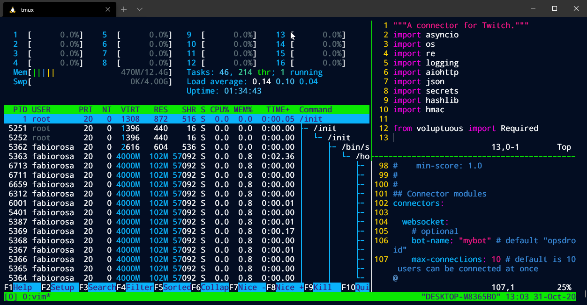

# Windows-Terminal-Themes

Custom made themes for windows terminal.

## Installing the theme

- Choose a theme from the list
- Open and copy the json from the theme file
- Open windows terminal settings (`CTRL+,`)
- Scroll down to `themes` and paste json from the theme
- Scroll up, find your profile (Ubuntu for example)
- Add `"colorScheme": "<theme name>" to your profile

## Themes

### 2077

Based off [endormi 2077 theme for VsCode](https://github.com/endormi/vscode-2077-theme) with some changes to the brightness of some colours.

